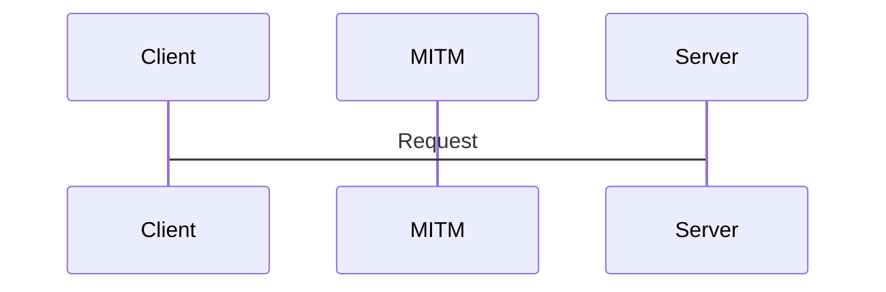

# OpenSSL

## OpenSSL CheatSheet
https://drive.google.com/drive/folders/1f0gmJCV1OqZ5VMiL8VhXv-SMaGb9NV6T

## 1. What is SSL? What is TLS ?
- The internet is many routers owned by many Diffrent ISPs. On either end : you and who you are 
   speaking too.
- When we  send request to websites, it either uses http or https, when using the http, the requested data is moved from different router and the data that travels are not encrypted, *in websites its not always asking for html file but some time we need to send the username,password,credit card number, bank account and so on and if these data are not encrypeted than our personal data are in big risk.*
- **So to solve this SSL/TLS are used.**
- SSL/TLS create a secure,protected tunnel across internet. i.e **https**
- SSL/TLS can also protect other data transfer. Example: to access corporate network(mail server, database.etc) , to connect to public vpn provider(nordvpn,experss vpn,cyberghost,etc)

| SSL | TLS |
|-----|-----|
|Secure Sockets Layer|Transport layer security|
|Created by NetScape in 1994| SSL maintenance handed to IETF in 1999. IETF renamed protocol to TLS|

***NOTE: SSL and TLS are just remaned version***

***
***
***

## 2.How do SSL/TLS protect your data?
- Data sent across a wire can be captured by anyone in the middle.

- puropse of SSL/TLS is to protect the data in three ways:

   - i)**Confidentiality**: Data is only Accessible by client and server - *Encryption*
   - ii)**Integrity**: Data is not modified between client and server. - *Hashing*
   - iii)**Autherntication**: Client/server are indeed who they are. - *PKI*

***NOTE: TUNNEL IS CONCEPTUAL ILLUSTRATION. DATA IS STILL PASSING THROUGH OTHER NETWORKS.***

***
***
***

## 3. Anti-Replay and Non-Repudiation.
