# OpenSSL

## OpenSSL CheatSheet
https://drive.google.com/drive/folders/1f0gmJCV1OqZ5VMiL8VhXv-SMaGb9NV6T


## 1. What is SSL? What is TLS ?
- The internet is many routers owned by many Diffrent ISPs. On either end : you and who you are 
   speaking too.
- When we  send request to websites, it either uses http or https, when using the http, the requested data is moved from different router and the data that travels are not encrypted, *in websites its not always asking for html file but some time we need to send the username,password,credit card number, bank account and so on and if these data are not encrypeted than our personal data are in big risk.*
- **So to solve this SSL/TLS are used.**
- SSL/TLS create a secure,protected tunnel across internet. i.e **https**
- SSL/TLS can also protect other data transfer. Example: to access corporate network(mail server, database.etc) , to connect to public vpn provider(nordvpn,experss vpn,cyberghost,etc)

| SSL | TLS |
|-----|-----|
|Secure Sockets Layer|Transport layer security|
|Created by NetScape in 1994| SSL maintenance handed to IETF in 1999. IETF renamed protocol to TLS|


***NOTE: SSL and TLS are just remaned version***

***
***
***

## 2.How do SSL/TLS protect your data?
- Data sent across a wire can be captured by anyone in the middle.

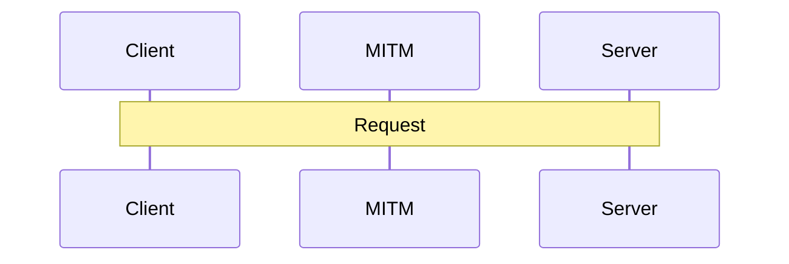
- puropse of SSL/TLS is to protect the data in three ways:

   - i)**Confidentiality**: Data is only Accessible by client and server - *Encryption*
   - ii)**Integrity**: Data is not modified between client and server. - *Hashing*
   - iii)**Autherntication**: Client/server are indeed who they are. - *PKI*

***NOTE: TUNNEL IS CONCEPTUAL ILLUSTRATION. DATA IS STILL PASSING THROUGH OTHER NETWORKS.***


***
***
***

## 3. Anti-Replay and Non-Repudiation.
### Anti-Replay
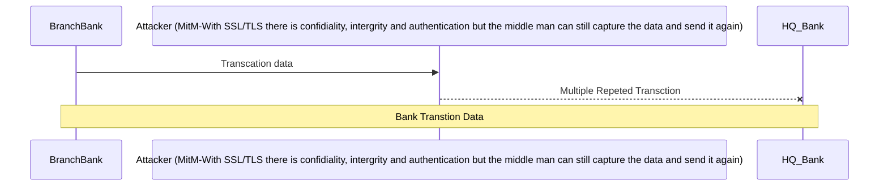

- *Suppose the Branch A is sending transtion of $1000 to HQ bank , in some specific user account, if the middle man capture it then , what? We know that he can not read data, due to confidentiality (Encryption) , we know he cannot change it , even if he did it we will know i.e due to integrity (Hashing) but what if he capture and crate multiple copy then sended in that same wire? That specific user acoount wil be full of $$$.*
- So, inorder to be protected from that there is anti-replay.
- Anti-Replay is provided with bulit-in sequqence number.
- That sequence number is built into Intergrity+ Authentication Mechanism.

### Non-Repudation:
- Meaning od Repudation: to refuse to have anything to do with.
- Suppose client sended some data and they are deining that they haven't sended it.
- Sendor cannot later deny sending a message. Byproduct of intergrity+ Authentication

***
***
***

## 4.Key Player of SSL.

- SSL/TLS  ecosystem involves three key players:
   - client
   - server
   - certificate authority (CA)
 
 - **Client:**
   - Entity initiating the TLS Handshake.
   - when we say client, we dont mean to say users, rather web browser, phone, app, IOT, etc.
   - Optionally authenticated (rare)


- **Server:**
  - Entity receiving the TLS handshake.
  - Web server:
    - Apache,IIS,NginX,etc...
    - Load Balancer or SSL accelerator.
 - Always authenticated [ meaning server have to prove that i am the valid one by giving certificate ]

- **Certificate Authority:**
   - Governing Entity that issues Certificates. [ Generates Certificate for Server ]
   - Trusted by client and server.
   - Provide Trust Anchor
      - if we trust CA , we trust what the CA trusts [meaning all client do not trust server but if  
        client trust the CA and CA trust the Server than , Client can trust CA]
   - Five Organizations secure 98% of the internet.
     ```mermaid
     graph LR
     IdenTrust["IdenTrust<br>51.9%"]
     DigiCert["DigiCert<br>19.4%"]
     Sectigo["Sectigo<br>17.5%"]
     GoDaddy["GoDaddy<br>6.9%"]
     GlobalSign["GlobalSign<br>2.9%"]

     IdenTrust---DigiCert
     DigiCert---Sectigo
     Sectigo---GoDaddy
     GoDaddy---GlobalSign
     ``` 
***
***
***

## 5.Hashing

- Algorithm which takes as input a message of arbitary length and produces as output a "Fingerprint" 
  of  the original message.
- *Let's say we want to hash the word "Hello" which simply adds tha alphabetic numeric of letter*

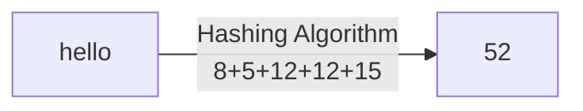
- Result of the Hashing Algorthim is called a Digest.
   - Also called: Checksum, Fingerprint , Hash, CRC , etc.

- if orginal data is changed , resulting digest will be different.
   - suppose someone changed the hello to cello , the resulting diest will be 47
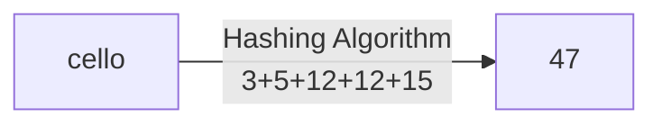

- **Real world Hashing Algorithms must satisfy four requirements:**
     - Infeasible to produce a given digest.
     - Impossible to extract orginal message.
     - Slight Changes produce drasric differnces.
     - Resulting digest is fied width(length)
  

### Collisons:
   - Two messages result in identical digests.
   - Connot be avoided.
        - it is a byproduct of "fixed width digest"
   - Imaginary Hashing algorithms:
        - prac-hash-3 bit digest.
             - "bit" is either 0 or 1
             - 3 bits means eight possible digest [ 2^8]
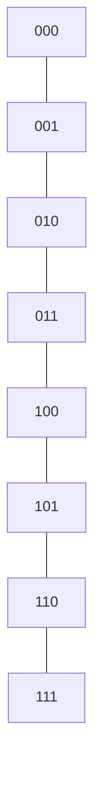
- Common Hashing Algorithms:
     - MD5         128bits
     - SHA/SHA1    160bits
     - SHA2 family:
          - SHA-224   224bits
          - SHA-256   256bits
          - SHA-382   384bits
          - SHA-512   512bits
      
***
***
***
## 6.Data Integrity.
   - Hashing is used to provide Integrity.
        - Sender Calculates Digest From the message.
        - Sender sends Message and Digest.
        - Receiver Calculates Digest From received Message.
        - Receiver compares both digests.
             - If digests are identical, the message was not modified in transit.
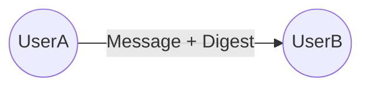
- What if there is Middle Man , attacking and capturing.
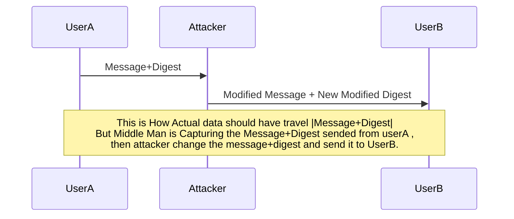
- Interceptor can modify the message and re-calculate hash.
- Receiver compares their Digest against modified Digest
- Simply sending the Messages Digest is not sufficient.
     - Something else must be done
 
- Both parties establish a mutual Secret Key.
- Sender combines Message+Secret Key to create Diges.
- Receiver verifies by calculating hash of message + secret key.
     - Message was not modified in transit - **INTERGITY**
     - Sender has the identical Secret Key- **Authentication**

### Message Authentication Code(MAC):
   - Concept of Combining Message + Secret Key when Calculating Digest.
   - Provides Intergrity & Authentication for Bulk Data Transfer.
   - Message + secret key must be combined in the same way.
   - ***INDUSTRY STANDARD OF HOW TO COMBINE THE KEY  AND MESSAGE IS HMAC. i.e HASHING [KEY+MESSAGE] 
     IS DIFFERNET THAN HASHING [MESSAGE+KEY].***
   - Hash Based Message Authention code (RFC 2104)

### Hashing Algorithm:
   - Input: Message.
   - Output: Digest.
   - Example: MD5,SHA1,etc
### MAC-Message Authentication Code:
   - Input: Message + Secret Key.
   - Output: Digest
   - Exampe: HMAC (Hash Based Message Authentication Code).

***
***
***

## 7.Encryption:

- Encryption is used to provide Confidentiality.
   - Confidentiality: only intended recipent can interpret thedat.

```mermaid
graph LR
Hello<br>Plain text---|Encryption<br>Decryption|lohel<br>CipherText.
```
   - Plain Text: Data before encryption & after decryption.
   - Cipher Text: Data while encrypted.
- Simple Encryption: Transforms PlainText into Cipher text.
     - Doesn't scale
     - Hard to do securely
     - Cannot simply use a standard algorithm.
**In real world Key Based Encryption is used**
- Key Based Encryption:
     - Combines industry vetted algotithm with a Secret Key.
          - Alogrithm is created by experts.
          - Secret keys can be randomly generated.
- There are two types of key based encryption:
     - Symmetric Encryption: Encrypt and Decrypt using the same keys.
     - Asymmetric Encryption: Encryprt & Decrypt using diferent key.

- For understanding this , lets take lowercase alphabets [ a b c d e f g h i j k l m n o p q r s t u v w x y z]
- **lets take the work hello and use the encryption using secret key 3 i.e move the alphabet by 3. similarly for decryptining moving backward the alphabet by 3]**

### SYMMETRIC KEY
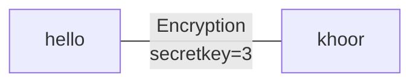
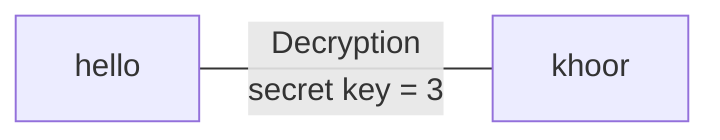
 ### ASYMMETRIC KEY 
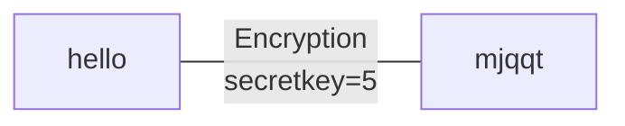
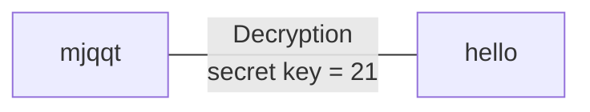
- *In Asymmetric encryption, one key is used foe encrption and other is for decryption*
   - Two different keys that are mathmatically related.
   - What one key encrpts, only the other can decrypt.
        - **One key will be made Public**
        - **Other Key will be kept Private**
- ***IF SOMEWANTS WANT TO SEND ME DATA, I SHOULD HAVE ALREADY SHARED MY PUBLIC KEY WHICH CAN BE ACCESS BY ANYONE , THE SENDER ENCRYPT THE DATA WITH MY PUBLIC KEY AND SEND IT TO ME, WHEN I RECEIVE THE DATA , ONLY MY PRIVITE KEY WILL BE ABLE TO DECRYPT IT***

  ### Strength and Weakness:
   #### Symmteric Encryption:
     - Stregth: Faster-Lower CPU Cost.
     - Strength: Ciper text is smae size as plain text.
     - Weakness: Secret Key must be shared-Less Secure.
     - Ideal for BULK DATA Transfer
   #### ASymmteric Encryption:
     - Weakness: Slower-requires much larger key sizes.
     - Weakness: Ciper text expansion
     - Strength: Private key is never shared-More Secure
     - restricted to limited Data


### SYMMETRIC Encryption Algorithms:
   - DES - 56BIT KEY
   - RC4 - 128 BIT KEY
   - 3DES-168 BIT KEY
   - AES -128,192 OR 256 BIT KEY
   - CHACHA20-128 OR 256 BIT KEY
     
### ASYMMETRIC Encryption Algorithms:
   - DSA
   - RSA
   - DIFFIE-HELLMAN
   - ECDSA
   - ECDH
     
